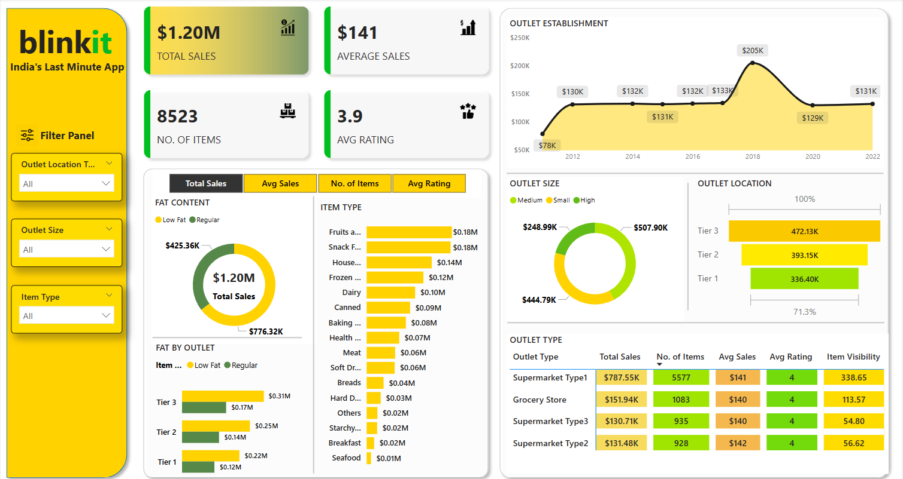

# 📊 Blinkit Sales Dashboard – Power BI Project

This project analyzes the sales performance of Blinkit using an interactive Power BI dashboard. It focuses on identifying trends in product sales, outlet performance, and customer satisfaction across different regions and categories.

## 🧾 Project Overview
- Developed using Power BI Desktop
- Visualized key metrics: Total Sales, Average Sales, Number of Items, and Average Rating
- Used filters such as Item Type, Outlet Type (Tier 1, 2, 3), and Location Type
- Discovered that **2018** recorded the **highest total sales**

## 📁 Files Included
- `Blinkit_Dashboard.pbix` – The Power BI file
- `Blinkit_Report.pptx` – Presentation/report with insights and recommendations
- `Blinkit Dashboard` – Preview images from the dashboard
- 

## 📈 Key Metrics
- 🔸 **Total Sales**: $1.2M  
- 🔸 **Average Sales**: $141  
- 🔸 **Number of Items**: 8,523  
- 🔸 **Average Rating**: 3.9 / 5

## 📊 Insights from the Dashboard

- 🏪 **Outlet Type Performance**  
  - Supermarket Type1 leads with **$787.55K** in total sales and 5,577 items sold  
  - Supermarket Type2 has the **highest Avg Sales per item** at **$142**  
  - All outlet types show a consistent **Avg Rating of 4**, indicating strong customer satisfaction

- 🌍 **Outlet Location Trends**  
  - **Tier 3 outlets** recorded the **highest total sales**: **$472.13K**  
  - Tier 1, usually urban, performed the lowest — suggesting Tier 3 areas may have greater demand or item volume

- 🥦 **Top-Selling Item Categories**  
  - **Fruits & Vegetables** and **Snack Foods** are top performers (~$180K each)  
  - Other strong categories include Household, Frozen, and Dairy items  
  - Items like Seafood and Breakfast show low sales, worth further analysis or promotion

- 🧈 **Sales by Fat Content**  
  - Regular fat products contributed **$776.32K** vs Low Fat's **$425.36K**  
  - This indicates a clear preference for regular fat items

- 📆 **Year-wise Sales Trend**  
  - **2018 had the highest sales** at **$205K**  
  - There was a sharp jump from 2017 to 2018, followed by a drop — potential for trend investigation

- 🧩 **Outlet Size Impact**  
  - **Medium-sized outlets** brought in **$507.90K**, outperforming smaller ones significantly  
  - Large outlet data is either missing or underperforming in the dataset

- 📊 **Visibility Insight**  
  - Supermarket Type1 had the highest **Item Visibility (338.65)** and also the highest sales — suggesting visibility positively impacts performance

## 🛠️ Tools & Skills Used
- Power BI • Data Cleaning • Data Visualization • Business Insights

## 📌 Author
**Arya Bhor**  
[LinkedIn](https://linkedin.com/in/aryabhor1001) • [Portfolio/GitHub](https://github.com/arya10012)
